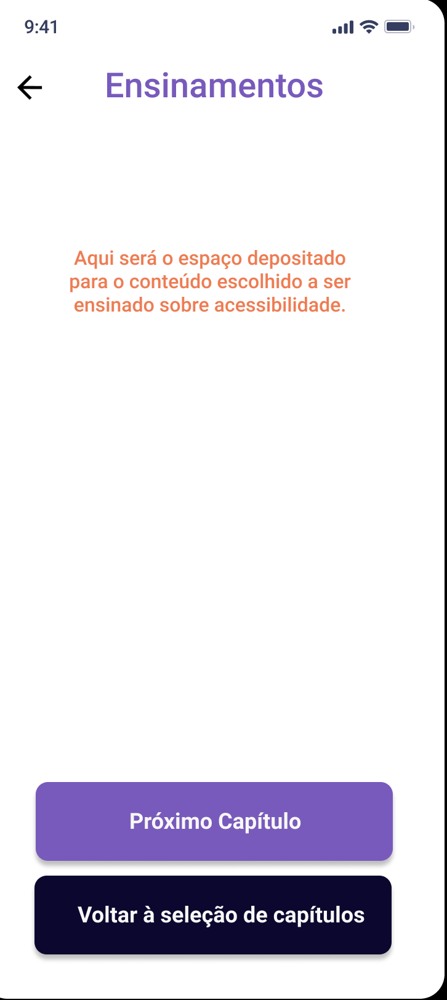

# Protótipo de Alta Fidelidade

## Introdução
O protótipo de alta fidelidade é uma demonstração interativa do produto de software, tendo como informações oriundas aquelas que são diretamente ligadas e necessárias para a produção do sistema em questão, ou seja, já apresenta maior semelhança com o design final em termos de detalhes e funcionalidade. 
O time desenvolveu um protótipo de alta fidelidade a partir dos esboços feitos com os protótipos de [baixa fidelidade](https://github.com/Design-de-Jogos/2020.1-MobileAccessibility).

## Protótipo de Alta Fidelidade

## Link para prototipo interativo
[Protótipo de Alta Fidelidade](https://www.figma.com/proto/7jHkaW8AplksTso9M2fXff/Prot%C3%B3tipo-D32?node-id=4%3A71&scaling=min-zoom)

## Versionamento
| Versão | Data | Modificação | Autor | Revisor |
| :---: | :---: | :---: | :---: | :---:|
| 1.0 | 14/11 | Criação do documento e adição do protótipo de alta fidelidade  | [João Gabriel Antunes](https://github.com/flyerjohn)  [Bruno Oliveira Dantas](https://github.com/BrunoOliveiraDantas) | [Marco Lima](https://github.com/markinlimac) |