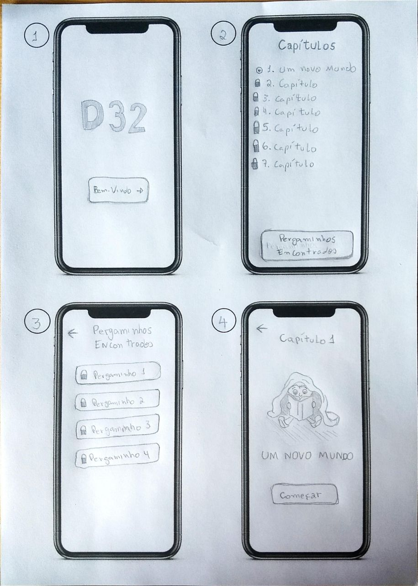
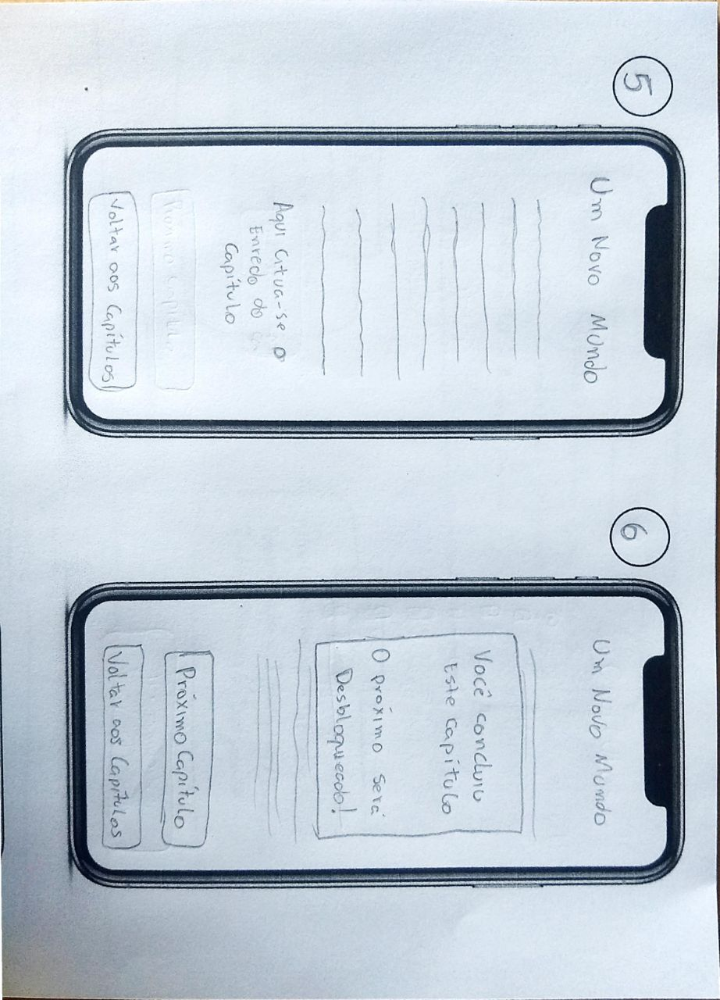

# Protótipo de Baixa Fidelidade

## Introdução
Prototipagem de papel é uma técnica que permite criar e testar interfaces de usuário de forma rápida e barata em que os protótipos, de papel, geram um excelente feedback de observação sobre o comportamento do usuário em relação ao design. Pode ser baseado em visuais de baixa (wireframes) alta fidelidade (mockups ou layouts), e quanto mais próximos da aparência final melhor serão os dados obtidos nestes testes.

## Protótipos

**Imagem 1 - Telas do prótotipo de papel.**

**Imagem 2 - Telas do prótotipo de papel.**

### Telas

**1 -** É a tela de entrada.

**2 -** É onde encontra-se os Capítulos(fases do jogo) que os jogadores poderam escolher o capítulo. No primeiro momento somente o Capítulo 1 será acessivel, os demais serão desbloqueados a medida em que o usúario enfrenta os desafios. Após desbloqueados eles poderam acessar qualquer capítulo no momento que quiser. Ainda na Segunda tela, existe um botão que encaminha para a tela de Perga,imhos do conhecimento.

**3 -** Os pergaminhos consistem nos conhecimentos sobre sobre acessibilidade, os jogadores irão desbloqueá-los durante a jornada desbravando os capítulos.

**4 -** A quarta tela é uma introdução ao capítulo, apertando no botão iniciar a história decorrente ao capítulo irá realmente começar.

**5 -** É a tela onde de fato é executada a história do capítulo. E possuí um botão que retorna para a seleção dos capítulos.

**6 -** Quando o Jogador finaliza o capítulo, um pop-up aparecer parabenizando-o. Dessa forma o próximo capítulo é desbloqueado.

**Observação** Foi decidido Apresentar apenas a tela o primeiro capítulo, julgando que todos os outros seguem a mesma lógica de apesentação da história. As únicas exceções são os capítulos que revelam um pergaminho de conhecimento e os capitulos das provações, que é o momento que é aplicado as perguntas sobre o tema para os jogadores.

## Referências
> [Protótipos de Papel. Por que fazê-los, o que eles agregam ao seu trabalho?](https://medium.com/aela/prototipos-de-papel-9f812d5b0dcc)

## Versionamento
| Versão | Data | Modificação | Autor | Revisor |
| :---: | :---: | :---: | :---: | :---:|
| 1.0 | 14/11 | Criação do documento e adição do protótipo de baixa fidelidade  | [João Gabriel Antunes](https://github.com/flyerjohn) | [Marco Lima](https://github.com/markinlimac)   [Bruno Oliveira Dantas](https://github.com/BrunoOliveiraDantas) |
| 1.1 | 16/11 | Acréscimo das telas do Protótipo e da descrição de cada tela.  | [Bruno Oliveira Dantas](https://github.com/BrunoOliveiraDantas) | [João Gabriel Antunes](https://github.com/flyerjohn)  |