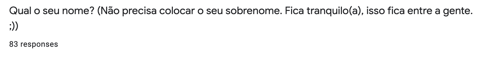
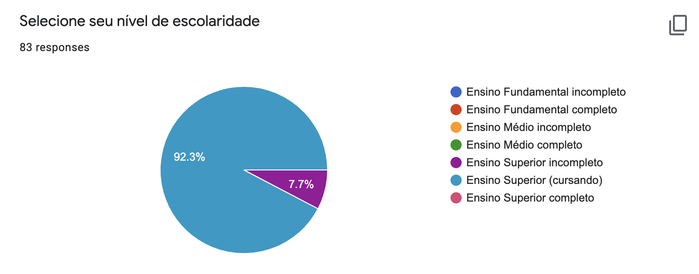
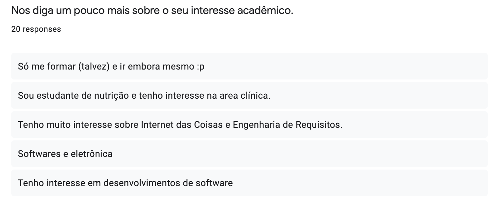
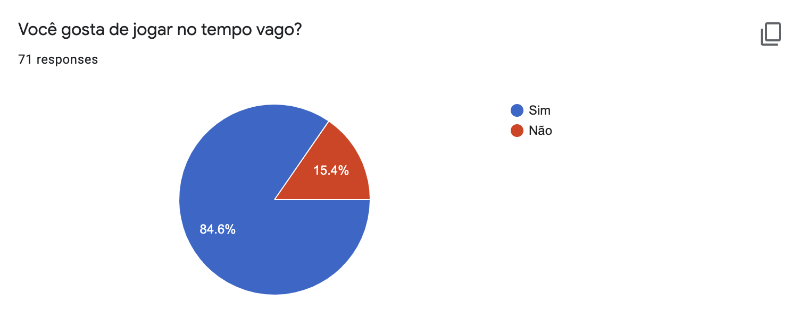
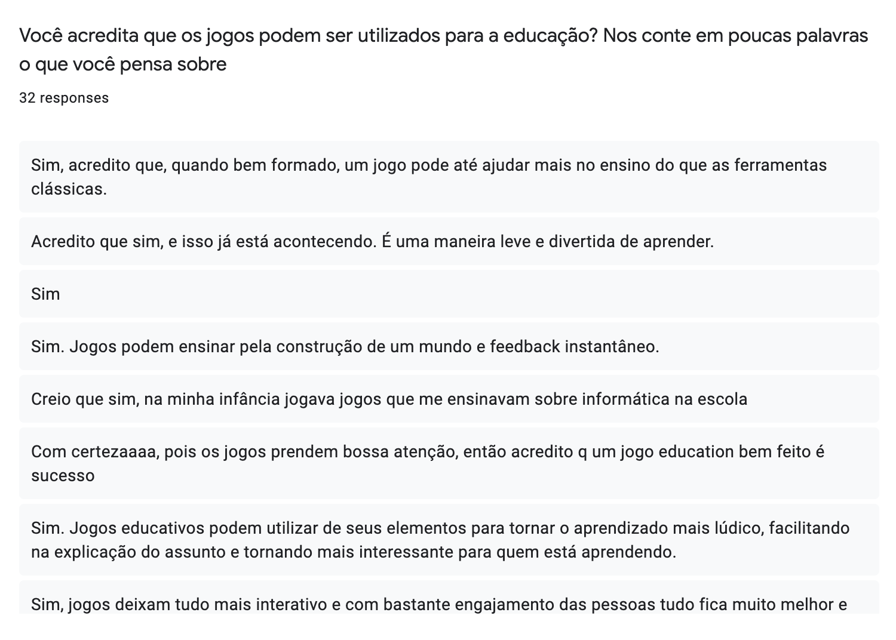
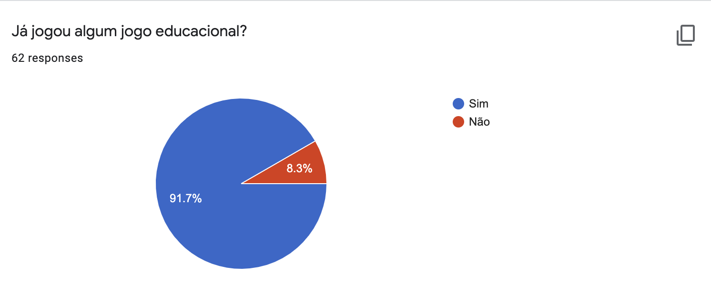
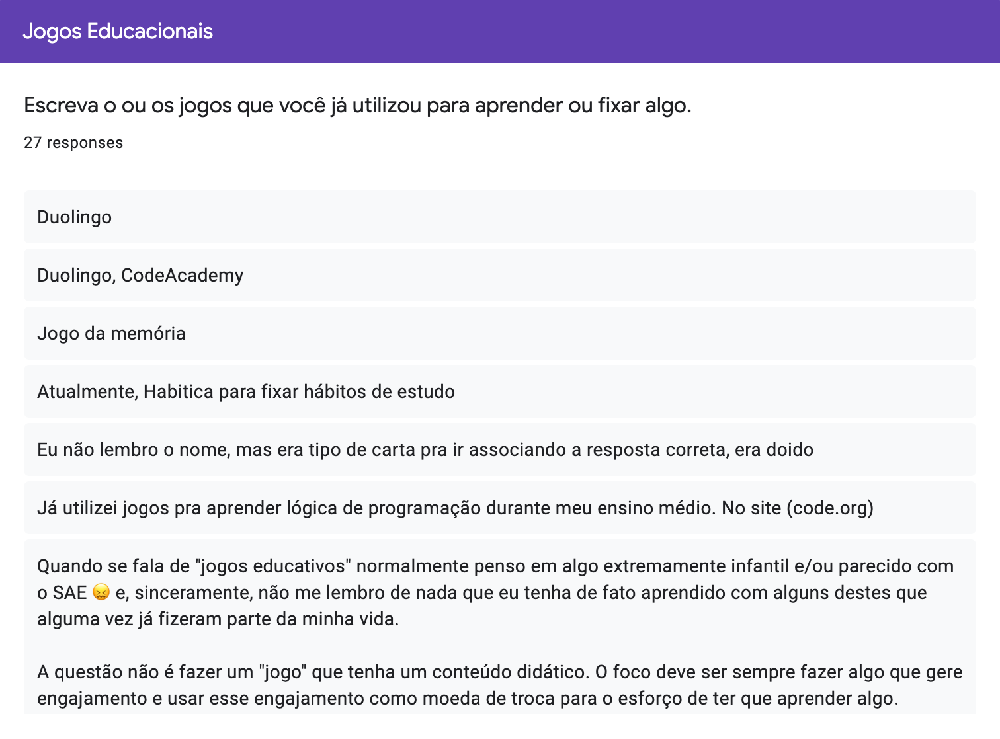

# Perfil de Usuário

## 1. Introdução

O questionário  é, geralmente, uma lista de perguntas acerca de dados necessários para traçar uma visão mais detalhada a respeito de algum aspecto do projeto de desenvolvimento de software. No caso do projeto D32, o questionário foi utilizado para o time de desenvolvimento ter uma visão mais clara dos perfis de possíveis usuários.

## 2. Considerações iniciais

Juntamente com o artefato de introspecção, o artefato apresentado nesse documento realiza um desenho de perfil de usuários, isso é muito interessante para a equipe focar e aprimorar as suas metas e objetivos para desenvolver o melhor jogo possível para esse tipo de perfil. O time decidiu juntar dados de, no mínimo, 70 pessoas diferentes, por conter um número considerável de respostas diversas, e assim, conseguir uma média mais balanceada de resultados.

## 3. Dados coletados

### Questão 1
Mantemos os dados dessa pergunta ocultos priorizando a privacidade dos participantes.

### Questão 2
Mantemos os dados dessa pergunta ocultos priorizando a privacidade dos participantes.

### Questão 3

### Questão 4

### Questão 5

### Questão 6

### Questão 7

### Questão 8

## 4. Considerações finais
Para manter o documento objetivo e conciso, nós não colocamos todas as respostas subjetivas submetidas nessa pesquisa, porém isso não fará falta para qualquer objetivo que este documento possui, até porque o time detém todos os dados coletados por este questionário.

## Versionamento
| Versão | Data | Modificação | Autor | Revisor |
| :---: | :---: | :---: | :---: | :---: |
| 1.0 | 01/10 | Criação do questionário  | [João Gabriel Antunes](https://github.com/flyerjohn) | [Marco Lima](https://github.com/markinlimac)
| 1.1 | 12/10 | Criação do documento  | [João Gabriel Antunes](https://github.com/flyerjohn) | [Marco Lima](https://github.com/markinlimac)