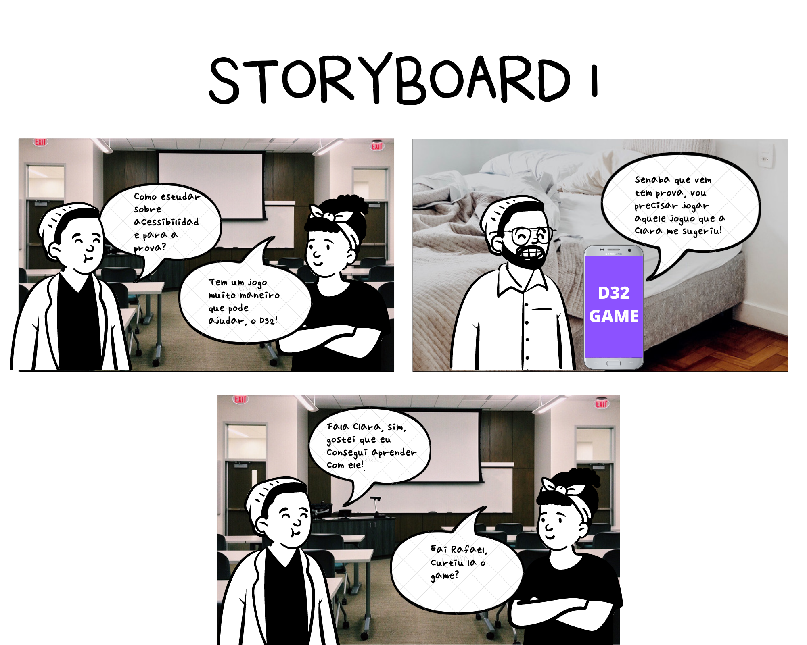

# Storyboards

## Introdução 
O Storyboard é um artefato que surgiu no mundo do entretenimento, era um documento que rascunhava e organizava elementos gráficos, como por exemplo, uma série de ilustrações ou imagens, com o objetivo de pré-visualizar um filme, uma animação, ou partes selecionadas desses filmes/animações. 

Esse artefato se provou muito útil para os engenheiros de software e/ou desenvolvedores, para que a ideia de um projeto de software saia do papel e se torne real. Para o desenvolvimento de sistemas, o Storyboard é interessante para contextualizar os *stakeholders* sobre o projeto. 

## Storyboard 1

## Versionamento
| Versão | Data | Modificação | Autor | Revisor |
| :---: | :---: | :---: | :---: | :---:|
| 1.0 | 13/11 | Criação do documento e adição do primeiro Storyboard  | [João Gabriel Antunes](https://github.com/flyerjohn) | [Marco Lima](https://github.com/markinlimac) |