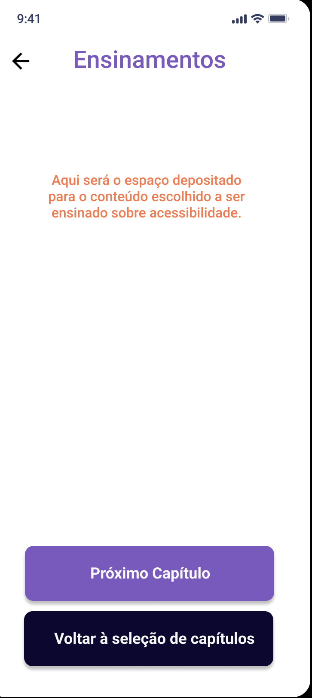

# Technical Design Document

## Personas

| Persona | Rafael |
| -- | -- |
| Nome: | Rafael Garcia |
| Idade: | 27 |
| Profissão: | Desenvolvedor Mobile |
| Escolaridade: | Ensino Médio |
| Nível de conhecimento de IHC: | Nunca estudou sobre, porém conhece os conceitos gerais. |
| História e contexto: | Rafael, como um desenvolvedor mobile,  está em contato direto com os princípios de criação  e manutenção de aplicações móveis,  porém sempre teve dificuldades para aprender  mais afundo sobre como deixar suas aplicações  acessíveis para todos o possíveis usuários. |
| O que ele deseja: | Rafael deseja muito aprender de forma prática e lúdica  como, por exemplo, por meio de um jogo sério ou atividades  práticas, já que possui um certo nível de conforto no  contexto de desenvolvimento. |

### Persona 2

| Persona | Clara |
| -- | -- |
| Nome: | Clara Almeida |
| Idade: | 20 |
| Profissão: | Estudante |
| Escolaridade: | Ensino Superior em curso |
| Nível de conhecimento de IHC: | Está atualmente aprendendo na disciplina correspondente  em sua universidade. |
| História e contexto: | Clara, como uma estudante de engenharia de software,  conhece os conceitos de qualidade de software e testes,  porém começou a estudar sobre Interação Humano  Computador no semestre atual,e ela acredita que não  possui materiais suficientes para aprender tudo sobre  os conceitos principais da matéria, acessibilidade sendo  o mais atrativo, em sua opinião. |
| O que ela deseja: | Clara deseja muito aprender sobre acessibilidade,   principalmente em interfaces móveis, por isso ela  deseja ter materiais auxiliares para ajudarem na  fixação do conteúdo visto em aula sobre esse  assunto em específico. |

### Persona 3

| Persona | Pedro |
| -- | -- |
| Nome: | Pedro Guimarães |
| Idade: | 16 |
| Profissão: | Estudante |
| Escolaridade: | Ensino Médio em curso |
| Nível de conhecimento de IHC: | Nunca ouviu falar de IHC. |
| História e contexto: | Pedro, como um estudante do ensino médio,  nunca teve um contato com os conceitos mais  aprofundados sobre qualidade de software, Interação  Humano Computador ou usabilidade, porém ele é um  adolescente muito entusiasmado sobre a programação  e, principalmente, desenvolvimento de aplicativos. |
| O que ele deseja: | Pedro deseja muito aprender sobre desenvolvimento  mobile, para que ele consiga fazer um app que ajuda  a irmã mais nova, com uma deficiência visual, a  sentir as mesmas sensações que ele ao enxergar  as cores. Para isso, precisa aprender também os  princípios e métricas de acessibilidade, e nada melhor que um  jogo em que se divirta enquanto aprende. |

## Metas de Usabilidade 

&emsp;&emsp;<b>Usabilidade</b>, segundo a norma ISO 9241, é a capacidade que um sistema interativo oferece a seu usuário, em um determinado contexto de operação, para a realização de tarefas de maneira eficaz, eficiente e agradável. Pode ser vista como uma propriedade que um produto de software deve ter de tal forma que os usuários típicos possam operar bem esse software para realizar as tarefas de que necessitam. Usabilidade pode ser considerada como a característica de adequação ao uso de um  produto de software, onde a adequação ao uso pode se desdobrar em cinco atributos principais: desempenho do usuário, facilidade de aprendizado, retenção do aprendizado com o uso intermitente, prevenção de erros do usuário e satisfação do usuário.

&emsp;&emsp;<b>Consistência</b> refere-se à coerência na aplicação de regras de uso dos dispositivos ou itens de interface. Todos os elementos que possuem as mesmas funções devemapresentar as mesmas características gráficas e operacionais. O reconhecimento imediato da função de um determinado item de interface pelo usuário é algo que se deve buscar sempre que se busca a padronização. Pode- se notar que a consistência contribui para melhorar a qualidade da interface em termos de todos os cinco principais atributos de usabilidade. É importante lembrar que a consistência pode envolver diversos aspectos. Os seguintes tipos de consistência são desejáveis:
 

- Expectativa dos usuários; 

- Entre aplicações relacionadas ou aplicações de uma mesma organização; 

- Com outros guias de estilo. Pode-se utilizar uma organização hierárquica de guias de estilo; Com padrões existentes na cultura da área; 

- De terminologia; 

- Entre páginas ou entre telas;

- Dentro de páginas, janelas; 

- Ícones; 

- Mensagens de diálogo, especificamente em mensagens de erro.

&emsp;&emsp;<b>Navegabilidade</b> é a propriedade, ou capacidade, que a interface do site possui de facilitar ao usuário chegar ao seu destino da maneira o mais eficiente possível. Corresponde à qualidade da estrutura viária que dá acesso ao conteúdo das informações no site.

&emsp;&emsp;<b>Interatividade</b> relaciona-se às interações do usuário que são um conjunto de operações ou  atividades que o usuário põe em prática com os objetos de tal modo a alterar o ambiente. No  projeto das ações do usuário deve ser detalhado como cada ação será representada, como o usuário vai pôr em prática a ação, e como será o efeito da ação completada.

&emsp;&emsp;<b>Clareza</b> diz respeito à evidência de se encontrar os itens principais da interface, ou seja, eles  devem ser claros o suficiente para que não haja dúvid a sobre sua funcionalidade e seu uso. Se não são evidentes, devem ser auto-explicativos.

&emsp;&emsp;<b>Flexibilidade</b> se refere aos meios colocados à disposição do usuário que lhe permitempersonalizar a interface, a fim de levar em conta as exigências da tarefa, de suas estratégias ou seus hábitos de trabalho. Ela corresponde também ao número das diferentes maneiras à disposição do usuário para alcançar um certo objetivo. Trata-se, em outros termos, da capacidade da interface de se adaptar as variadas ações do usuário. 

&emsp;&emsp;<b>Legibilidade</b> diz respeito às características lexicais das informações apresentadas na tela que  possam dificultar ou facilitar a leitura dessa informação (brilho do caractere, contraste letra/fundo, tamanho da fonte, espaçamento entre palavras espaçamento entre linhas, espaçamento de parágrafos, comprimento da linha, etc).

&emsp;&emsp;Um software, qualquer que seja ele, tem sempre que trilhar esse caminho em busca de atingir todas as metas de usabilidade. A diferença de programas que seguem as heuristicas, propostas por Nielsen (1990), e os que não seguem é mais que gritante. É notável o impacto dessas metas de usabilidade causam no usuário, e isso define muito a qualidade desse software.

&emsp;&emsp;O projeto desenvolvido por esse time seguirá nesse caminho necessário de contemplação de todas, se possível, as metas de usabilidades descritas acima, e, conforme os marcos forem sendo atingidos, esse guia deverá ser atualizado a fim de realizar o registro padrão. 

## Protótipo de Alta Fidelidade

## Link para prototipo interativo
[Protótipo de Alta Fidelidade](https://www.figma.com/proto/7jHkaW8AplksTso9M2fXff/Prot%C3%B3tipo-D32?node-id=4%3A71&scaling=min-zoom)
## Referências
> BARBOSA, S. D. J.; SILVA, B. S. DA. Interação Humano-Computador, 2010.

## Versionamento
| Versão | Data | Modificação | Autor | Revisor |
| :---: | :---: | :---: | :---: | :---:|
| 1.0 | 26/11 | Criação do documento | [João Gabriel Antunes](https://github.com/flyerjohn)  [Bruno Oliveira Dantas](https://github.com/BrunoOliveiraDantas) | [Marco Lima](https://github.com/markinlimac) |
